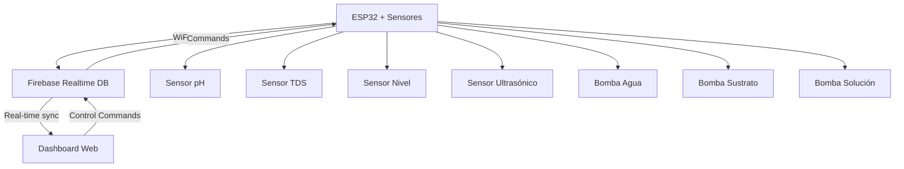

# 🌱 Sistema Hidropónico - Monitoreo Inteligente


Un sistema completo de monitoreo hidropónico para cultivo de lechuga con monitoreo en tiempo real, control de actuadores y interfaz web moderna.

## 📋 Tabla de Contenidos

- [🎯 Características](#-características)
- [🏗️ Arquitectura del Sistema](#️-arquitectura-del-sistema)
- [🔧 Hardware Requerido](#-hardware-requerido)
- [⚡ Instalación](#-instalación)
- [🚀 Configuración](#-configuración)
- [📱 Uso del Sistema](#-uso-del-sistema)
- [🔌 Conexiones Hardware](#-conexiones-hardware)
- [🛠️ Desarrollo](#️-desarrollo)
- [🐛 Troubleshooting](#-troubleshooting)
- [📊 Monitoreo](#-monitoreo)
- [🤝 Contribuir](#-contribuir)

## 🎯 Características

### 🌡️ Monitoreo en Tiempo Real

- **pH del agua** - Sensor PH4502C
- **TDS (Total Dissolved Solids)** - Sensor SEN0244
- **Nivel de líquido** - Sensor SEN0205
- **Nivel del tanque** - Sensor ultrasónico

### 🎮 Control de Actuadores

- **Bomba de agua** - Control automático/manual
- **Bomba de sustrato** - Dosificación precisa
- **Bomba de solución nutritiva** - Control pH automático

### 📊 Dashboard Web Moderno

- **Interfaz responsive** - Compatible con móviles y desktop
- **Tiempo real** - Actualización automática vía Firebase
- **Gráficos interactivos** - Historial de pH y TDS
- **Tema claro/oscuro** - Experiencia personalizable
- **PWA Ready** - Instalable como aplicación

### 🔥 Backend en la Nube

- **Firebase Realtime Database** - Base de datos en tiempo real
- **Sincronización automática** - Entre ESP32 y web
- **Historial de datos** - Almacenamiento persistente

## 🏗️ Arquitectura del Sistema



### Componentes Principales

1. **Firmware ESP32** (`src/main.cpp`)

   - Lectura de sensores
   - Conexión WiFi/Firebase
   - Control de actuadores
   - Sistema de diagnóstico

2. **Frontend Web** (`frontend/`)

   - Dashboard interactivo (Next.js + React)
   - Gráficos en tiempo real
   - Control remoto de bombas
   - Interfaz responsive

3. **Base de Datos** (Firebase)
   - Almacenamiento en tiempo real
   - Sincronización bidireccional
   - Historial de datos

## 🔧 Hardware Requerido

### Componentes Principales

- **1x ESP32 DevKit** - Microcontrolador principal
- **1x Sensor pH PH4502C** - Medición de pH del agua
- **1x Sensor TDS SEN0244** - Medición de sólidos disueltos
- **1x Sensor de nivel SEN0205** - Control de nivel de líquido
- **1x Sensor ultrasónico HC-SR04** - Medición de nivel del tanque
- **3x Bombas de agua 12V** - Agua, sustrato y solución nutritiva
- **3x Relés 5V** - Control de bombas
- **1x Protoboard** - Conexiones temporales
- **Cables jumper** - Conexiones
- **Resistencias** - Según esquema

### Alimentación

- **Fuente 12V 2A** - Para bombas
- **Regulador 5V** - Para sensores
- **USB** - Para ESP32 (desarrollo)

## ⚡ Instalación

### Prerrequisitos

1. **Instalar Python 3.8+**

   - Descargar desde [python.org](https://www.python.org/downloads/windows/)
   - ✅ Marcar "Add Python to PATH"
   - ✅ Marcar "Install pip"

2. **Instalar Node.js 18+**

   - Descargar desde [nodejs.org](https://nodejs.org/)
   - Instalar con configuración por defecto

3. **Instalar Git**

   - Descargar desde [git-scm.com](https://git-scm.com/download/win)
   - Usar configuración recomendada

4. **Instalar Driver USB ESP32**
   - Descargar CP210x Driver desde [Silicon Labs](https://www.silabs.com/developers/usb-to-uart-bridge-vcp-drivers)
   - Instalar y reiniciar

#### Clonar e Instalar Proyecto

```cmd
# Abrir PowerShell como Administrador

# Clonar repositorio
git clone https://github.com/jcristancho2/hydroponic-monitoring.git
cd hydroponic-monitoring

# Crear entorno virtual Python
python -m venv .venv
.venv\Scripts\activate

# Instalar PlatformIO
pip install platformio

# Instalar dependencias del frontend
cd frontend
npm install
cd ..
```

#### Configurar Variables de Entorno (Windows)

```cmd
# Añadir PlatformIO al PATH
set PATH=%PATH%;%USERPROFILE%\.platformio\penv\Scripts
```

## 🚀 Configuración

### 1. Configurar Firebase

#### Crear Proyecto Firebase

1. Ir a [Firebase Console](https://console.firebase.google.com/)
2. Crear nuevo proyecto: "proyecto-hidroponico"
3. Habilitar **Realtime Database**
4. Configurar reglas de seguridad:

```json
{
  "rules": {
    "hydroponic_data": {
      ".read": true,
      ".write": true
    }
  }
}
```

#### Obtener Credenciales

1. **Database URL**: `https://proyecto-hidroponico-xxxx-default-rtdb.firebaseio.com/`
2. **API Key**: Ir a Configuración → Configuración general → Claves API web
3. **Database Secret**: Ir a Configuración → Cuentas de servicio → Secretos de base de datos

### 2. Configurar ESP32

Editar `src/config.h`:

```cpp
// WiFi Configuration
#define WIFI_SSID "Tu_Red_WiFi"
#define WIFI_PASSWORD "tu_password"

// Firebase Configuration
#define API_KEY "tu_api_key_aqui"
#define DATABASE_URL "https://tu-proyecto-default-rtdb.firebaseio.com/"
#define DATABASE_SECRET "tu_database_secret"
```

### 3. Configurar Frontend

Editar `frontend/components/dashboard-view.tsx`:

```tsx
const firebaseConfig = {
  databaseURL: "https://tu-proyecto-default-rtdb.firebaseio.com",
};
```

## 📱 Uso del Sistema

### Subir Firmware al ESP32

```cmd
# Activar entorno virtual
.venv\Scripts\activate

# Compilar y subir
pio run --target upload

# Monitorear salida serial
pio device monitor --port COM3 --baud 115200
```

### Ejecutar Dashboard Web

#### Modo Desarrollo

```cmd
# En directorio frontend/
npm run dev

# Abrir navegador en:
# http://localhost:3000
```

#### Modo Producción

```cmd
# Construir para producción
npm run build

# Ejecutar servidor de producción
npm start
```

#### Servidor HTTP Simple

```cmd
# En directorio frontend/
python -m http.server 8000

# Abrir navegador en:
# http://localhost:8000
```

## 🔌 Conexiones Hardware

### Diagrama de Conexiones ESP32

```
ESP32 DevKit v1
┌─────────────────┐
│ 3V3  ┌─────┐GND │
│ EN   │     │D23 │ ──→ Relay 1 (Bomba Agua)
│ D36  │     │D22 │ ──→ Relay 2 (Bomba Sustrato)
│ D39  │     │D21 │ ──→ Relay 3 (Bomba Solución)
│ D34  │     │D19 │ ──→ Sensor TDS (Signal)
│ D35  │ ESP │D18 │ ──→ Sensor pH (Signal)
│ D32  │ 32  │D5  │ ──→ Ultrasonido (Trigger)
│ D33  │     │D17 │ ──→ Ultrasonido (Echo)
│ D25  │     │D16 │ ──→ Sensor Nivel (Signal)
│ D26  │     │D4  │
│ D27  │     │D0  │
│ D14  │     │D2  │
│ D12  └─────┘GND │
│ GND         3V3 │
└─────────────────┘
```

### Tabla de Conexiones

| Componente       | ESP32 Pin | Alimentación | Notas     |
| ---------------- | --------- | ------------ | --------- |
| Sensor pH        | D18 (A0)  | 5V           | Analógico |
| Sensor TDS       | D19 (A1)  | 5V           | Analógico |
| Sensor Nivel     | D16 (A2)  | 5V           | Analógico |
| Ultrasónico Trig | D5        | 5V           | Digital   |
| Ultrasónico Echo | D17       | 5V           | Digital   |
| Relé Bomba 1     | D23       | 5V           | Digital   |
| Relé Bomba 2     | D22       | 5V           | Digital   |
| Relé Bomba 3     | D21       | 5V           | Digital   |

### Esquema de Alimentación

```
12V PSU ──┬──→ Bombas (12V)
          └──→ Regulador 5V ──┬──→ ESP32 (5V)
                              ├──→ Sensores (5V)
                              └──→ Relés (5V)
```

## 🛠️ Desarrollo

### Estructura del Proyecto

```
hydroponic_monitoring/
├── src/                          # Firmware ESP32
│   ├── main.cpp                 # Código principal
│   └── config.h                 # Configuración
├── frontend/                    # Dashboard Web
│   ├── app/                     # Next.js App Router
│   ├── components/              # Componentes React
│   ├── public/                  # Archivos estáticos
│   └── styles/                  # Estilos CSS
├── platformio.ini               # Configuración PlatformIO
└── README.md                    # Este archivo
```

### Comandos de Desarrollo

```cmd
# ESP32 Development
pio run                          # Compilar
pio run --target upload          # Subir firmware
pio device monitor               # Monitor serial
pio run --target clean           # Limpiar build

# Frontend Development
npm run dev                      # Servidor desarrollo
npm run build                    # Build producción
npm run lint                     # Linter
npm run type-check               # Verificar tipos TypeScript
```

### Testing

#### Test del Hardware

```cmd
# Ejecutar diagnósticos del ESP32
pio device monitor --filter=esp32_exception_decoder
```

#### Test del Frontend

```cmd
# En directorio frontend/
npm run test                     # Tests unitarios
npm run test:e2e                 # Tests end-to-end
```

## 🐛 Troubleshooting

### Problemas Comunes ESP32

#### No se conecta al WiFi

```cpp
// Verificar en Serial Monitor:
// 1. SSID y password correctos
// 2. Red 2.4GHz (no 5GHz)
// 3. Calidad de señal > -70dBm
```

#### Error de Firebase

```
Token error: code: 400, message: TOO_MANY_ATTEMPTS_TRY_LATER
```

**Solución**: Esperar 1 hora o usar autenticación anónima

#### Puerto USB ocupado

```cmd
# Cerrar procesos que usen el puerto
taskkill /F /IM "platformio.exe"
taskkill /F /IM "monitor.exe"
```

#### Puerto USB no detectado

1. Instalar driver CP210x
2. Verificar en Device Manager
3. Probar cable USB diferente

### Problemas Comunes Frontend

#### Error de conexión Firebase

```javascript
// Verificar en browser console:
// 1. CORS configurado correctamente
// 2. URL de base de datos correcta
// 3. Reglas de seguridad permisivas
```

#### Build fails

```cmd
# Limpiar caché y reinstalar
rmdir /s /q .next node_modules package-lock.json
npm install
```

### Logs y Debugging

#### ESP32 Serial Monitor

```cmd
# Ver logs en tiempo real
pio device monitor --filter=colorize --filter=time
```

#### Firebase Debug

1. Abrir Firefox/Chrome DevTools
2. Ir a Network tab
3. Filtrar por "firebaseio.com"
4. Verificar requests/responses

## 📊 Monitoreo

### Métricas del Sistema

El sistema recopila las siguientes métricas:

#### Sensores (Cada 10 segundos)

- **pH**: 0.0 - 14.0 (Óptimo: 5.5 - 7.5)
- **TDS**: 0 - 2000 ppm (Óptimo: 800-1200 ppm)
- **Nivel Líquido**: 0-100% (Mínimo: 20%)
- **Nivel Tanque**: 0-100 cm (Mínimo: 20 cm)

#### Sistema (Cada minuto)

- Estado de conexión WiFi
- Calidad de señal (RSSI)
- Memoria libre ESP32
- Uptime del sistema

#### Actuadores (En tiempo real)

- Estado bombas (ON/OFF)
- Tiempo de operación
- Ciclos de trabajo

### Dashboard Analytics

El dashboard web muestra:

- **Tiempo real**: Valores actuales de todos los sensores
- **Gráficos**: Historial de pH y TDS (últimas 20 lecturas)
- **Estado**: Conexión ESP32 y Firebase
- **Control**: Botones para activar/desactivar bombas

## 🤝 Contribuir

### Cómo Contribuir

1. **Fork** el repositorio
2. **Crear** una rama para tu feature (`git checkout -b feature/AmazingFeature`)
3. **Commit** tus cambios (`git commit -m 'Add some AmazingFeature'`)
4. **Push** a la rama (`git push origin feature/AmazingFeature`)
5. **Abrir** un Pull Request

### Directrices de Desarrollo

- Usar **commits semánticos**: `feat:`, `fix:`, `docs:`, `style:`
- **Documentar** nuevas funciones
- **Probar** antes de hacer PR
- Seguir **convenciones de código** existentes

### Roadmap

- [ ] **Control automático pH** - Algoritmo PID
- [ ] **Alertas push** - Notificaciones móviles
- [ ] **Histórico extendido** - Base de datos SQL
- [ ] **Machine Learning** - Predicción de crecimiento
- [ ] **App móvil nativa** - React Native
- [ ] **Multi-cultivo** - Soporte para varios tipos de plantas

---

## 📄 Licencia

Este proyecto está bajo la Licencia MIT. Ver el archivo `LICENSE` para más detalles.

## 🙏 Agradecimientos

- **PlatformIO** - Por el excelente framework de desarrollo
- **Firebase** - Por la base de datos en tiempo real
- **Next.js** - Por el framework web moderno
- **Tailwind CSS** - Por el sistema de diseño
- **Lucide React** - Por los iconos hermosos

---

## 📞 Soporte

Si necesitas ayuda:

1. **Documentación**: Lee este README completo
2. **Issues**: Abre un issue en GitHub con:

   - Descripción del problema
   - Logs del Serial Monitor
   - Screenshots si es necesario
   - Información del sistema (OS, versiones)


---

### 🌟 ¡Dale una estrella al repo si te gustó el proyecto!

**¡Feliz cultivo hidropónico!** 🌱🚀
